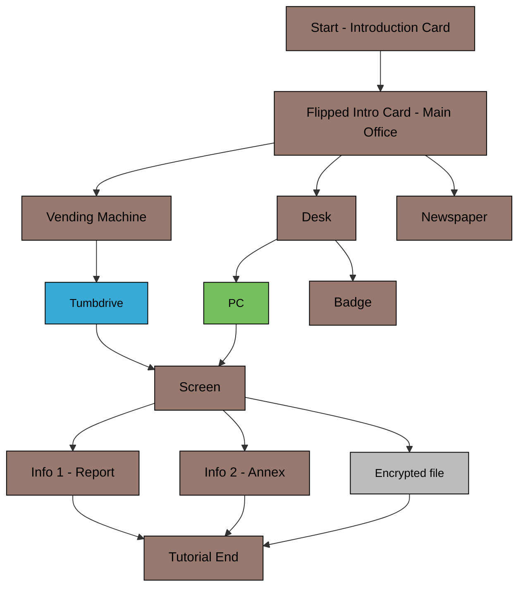

# Functional Specifications

Table of Contents

- [Functional Specifications](#functional-specifications)
  - [1. Introduction](#1-introduction)
    - [1.1. Glossary](#11-glossary)
    - [1.2. Project Overview](#12-project-overview)
    - [1.3. Project Definition](#13-project-definition)
      - [1.3.1. Vision](#131-vision)
      - [1.3.2. Objectives](#132-objectives)
      - [1.3.3. Scope](#133-scope)
      - [1.3.4. Target Audience](#134-target-audience)
      - [1.3.5. Deliverables](#135-deliverables)
    - [1.4. Project Organization](#14-project-organization)
      - [1.4.1. Project Representatives](#141-project-representatives)
      - [1.4.2. Stakeholders](#142-stakeholders)
  - [2. Functional Requirements](#2-functional-requirements)
    - [2.1. Game Components](#21-game-components)
      - [2.1.1. Physical - Card Deck](#211-physical---card-deck)
      - [2.1.2. Digital - Mobile Application](#212-digital---mobile-application)
  - [2.2. Game Mechanics](#22-game-mechanics)
    - [2.2.1. Overview](#221-overview)
    - [2.2.2. Card Types and Functions](#222-card-types-and-functions)
      - [2.2.2.1 Left/Right Action Cards (Blue/Green Cards)](#2221-leftright-action-cards-bluegreen-cards)
      - [2.2.2.2 Grey Cards (Machines)](#2222-grey-cards-machines)
      - [2.2.2.3 Brown Cards (Locations)](#2223-brown-cards-locations)
      - [2.2.2.4 Red Cards (Penalties)](#2224-red-cards-penalties)
    - [2.2.3. Game Progression](#223-game-progression)
      - [2.2.3.1 Combining Cards](#2231-combining-cards)
      - [2.2.3.2 Interacting with Machines](#2232-interacting-with-machines)
      - [2.2.3.3 Exploring Locations](#2233-exploring-locations)
      - [2.2.3.4 Requesting Hints](#2234-requesting-hints)
      - [2.2.3.5 Time and Penalties](#2235-time-and-penalties)
    - [2.2.4. App Features](#224-app-features)
      - [2.2.4.1 Code Entry](#2241-code-entry)
      - [2.2.4.2 Machine Interactions](#2242-machine-interactions)
      - [2.2.4.3 Audio and Visual Cues](#2243-audio-and-visual-cues)
      - [2.2.4.4 Hint System](#2244-hint-system)
      - [2.2.4.5 Timer](#2245-timer)
    - [2.2.5. Victory and Loss Conditions](#225-victory-and-loss-conditions)
    - [2.3. Mockups](#23-mockups)
      - [2.3.1 Cards Mockups](#231-cards-mockups)
      - [2.3.2 App Mockups](#232-app-mockups)
    - [2.4. Technical Requirements](#24-technical-requirements)
    - [2.4.1. Application (Godot Engine)](#241-application-godot-engine)
      - [2.4.1.1. Orientation and Platform](#2411-orientation-and-platform)
      - [2.4.1.2. User Interaction](#2412-user-interaction)
      - [2.4.1.3. Timer](#2413-timer)
      - [2.4.1.4. Background Music](#2414-background-music)
      - [2.4.1.5. Machine Puzzles](#2415-machine-puzzles)
    - [2.4.2. Physical Cards](#242-physical-cards)
      - [2.4.2.1. Specifications](#2421-specifications)
      - [2.4.2.2. Functional Design](#2422-functional-design)
    - [2.4.3. App-Card Integration](#243-app-card-integration)
      - [2.4.3.1. Code Validation](#2431-code-validation)
      - [2.4.3.2. Hint System](#2432-hint-system)
      - [2.4.3.3. Story Progression](#2433-story-progression)
    - [2.4.4. Functional Limits and Gameplay Scope](#244-functional-limits-and-gameplay-scope)
      - [2.4.4.1. Scenario Length](#2441-scenario-length)
      - [2.4.4.2. No QR Codes](#2442-no-qr-codes)
      - [2.4.4.3. Single Game Design](#2443-single-game-design)
    - [2.5. Scenarios](#25-scenarios)
      - [2.5.1. Tutorial](#251-tutorial)
      - [2.5.2. Scenario 1: Gatekeeper](#252-scenario-1-gatekeeper)
    - [2.6. Performance Metrics](#26-performance-metrics)
    - [2.7. End-Game Ranking](#27-end-game-ranking)
      - [2.7.1. Ranking Breakdown:](#271-ranking-breakdown)
  - [3. Non-Functional Requirements](#3-non-functional-requirements)

## 1. Introduction

### 1.1. Glossary

| Term         | Definition                                                                                       |
| ------------ | ------------------------------------------------------------------------------------------------ |
| Serious Game | A game designed for purposes beyond pure entertainment, often educational or training-focused.   |
| Gamification | The application of game-design elements in non-game contexts to enhance engagement and learning. |
| Godot 4.0    | A cross-platform, open-source game engine used for developing both 2D and 3D games.              |

### 1.2. Project Overview

This project aims to create a serious game focused on climate change, designed to be platform-agnostic, and accessible across diverse devices.

### 1.3. Project Definition

#### 1.3.1. Vision

The vision is to educate players about climate change by embedding factual knowledge in a gamified, adventure-driven environment. The game aims to challenge misconceptions and deepen players’ understanding of environmental issues while keeping the experience enjoyable and interactive.

#### 1.3.2. Objectives

- Develop a Serious Game centeGreen around climate change.
- Design engaging, adventure-based gameplay to captivate players.
- Use Godot 4.0 for seamless deployment across digital platforms.

#### 1.3.3. Scope

This project seeks to:

- Teach users lesser-known facts about climate change.
- Address and correct common misconceptions about the environment.
- Create an accessible and interactive learning tool adaptable for different audiences.

#### 1.3.4. Target Audience

- **Teenagers & Young Adults:** Teenagers willing to expand their general knowledge or to delve deeper into cliamte change understanding.
- **Families:** Families wanting to spend a great time in an adventure together while gaining general knowledge and doing some brain exercises.

#### 1.3.5. Deliverables

The following deliverables will be provided as part of the project:

- Game Assets:
  - Source code for the digital game developed using Godot 4.0.
  - Physical components (e.g., printed cards) used for gameplay.
- Mock-ups and Prototypes:
  - Iterative mock-ups and game prototypes to gather feedback and ensure alignment with client expectations.
- Supporting Documentation:
  - Functional Specification: Outlines the game's features and functionality.
  - Technical Specification: Details the technical architecture and implementation.
  - Test Plan: Describes the strategy for ensuring the game's quality and reliability.
  - User Manual: Guides end-users on how to play and interact with the game.
  - Management Planning and Weekly Reports: Tracks progress and highlights milestones.
- Final Presentation:
  - A 15-minute presentation summarizing the project's outcomes, key insights, and deliverables.

### 1.4. Project Organization

#### 1.4.1. Project Representatives

| Full Name          | Occupation        | Links                                                                      |
| ------------------ | ----------------- | -------------------------------------------------------------------------- |
| Maxime THIZEAU     | Project manager   | [LinkedIn](https://linkedin.com/in/maxime-thizeau-0b311a293)               |
| Benoît DE KEYN     | Program manager   | [LinkedIn](https://www.linkedin.com/in/beno%C3%AEt-de-keyn-71611b293/)     |
| Pavlo PRENDI       | Tech lead         | [LinkedIn](https://www.linkedin.com/in/pavlo-prendi-674777309/)            |
| Aurélien FERNANDEZ | Software Engineer | [LinkedIn](https://www.linkedin.com/in/aur%C3%A9lien-fernandez-4971201b8/) |
| Thibaud MARLIER    | Software Engineer | [LinkedIn](https://www.linkedin.com/in/thibaudmarlier/)                    |
| Mathis KAKAL       | Quality assurance | [LinkedIn](https://www.linkedin.com/in/mathis-k-a239ba10a/)                |
| Antoine PREVOST    | Technical writer  | [LinkedIn](https://www.linkedin.com/in/antoine-prevost-dev/)               |

#### 1.4.2. Stakeholders

| Role   | Representative           | Expectation                                                             |
| ------ | ------------------------ | ----------------------------------------------------------------------- |
| Client | Franck JEANNIN (ALGOSUP) | Project meeting the requirements and traceability of the project events |

## 2. Functional Requirements

### 2.1. Game Components

Our game is hybrid, which means you need both a physical card deck as well as a mobile application to play the game. This prevents young audiences to speend too much time in front of screens, which is a problem nowadays.

#### 2.1.1. Physical - Card Deck

The card deck is the main medium allowing players to progress through the escape game adventures. Each of the card has a unique number or letter, indicated at the back of the card as well as at the top left corner of the card. There are in total 4 types of cards in the game, each distiguishable by the color on the top of the card:

| Card Type Name | Description                                                                                                                                                                                                                                                      | Template image                                  |
| -------------- | ---------------------------------------------------------------------------------------------------------------------------------------------------------------------------------------------------------------------------------------------------------------- | ----------------------------------------------- |
| Information    | Gives information on an element of the gameplay/Gives a fact about climate change                                                                                                                                                                                |           |
| Machine        | Redirects to an interactive puzzle on the app, or one of its parts. The number of the card can be entered when clicking on the "Machine" button and filling the popup to access the interactive machine puzzle on the app.                                       |              |
| Left Action    | They contain a visual element, generally an object, which can be logically combined with an element on a "Right Action Card". The sum of the two cards should allow the player to take the card with the equivalent number, either a penalty or the correct one. |    |
| Right Action   | They contain a visual element, generally an object, which can be logically combined with an element on a "Left Action Card". The sum of the two cards should allow the player to take the card with the equivalent number, either a penalty or the correct one.  |  |
| Penalty        | They indicate a wrong path taken by the player, resulting in a time penalty the player has to fill in the application.                                                                                                                                           |            |

#### 2.1.2. Digital - Mobile Application

## 2.2. Game Mechanics

### 2.2.1. Overview
The game is a cooperative escape-room experience that uses **physical cards** and a **mobile application** as a guide. Players solve puzzles, explore locations, and progress through the story by interacting with cards and the app.

### 2.2.2. Card Types and Functions
Each card serves a specific purpose and drives the game forward. The following categories describe the types of cards and their mechanics:

#### 2.2.2.1 Left/Right Action Cards (Blue/Green Cards)
- **Blue Cards (Left Action Cards)**:
  - Represent **objects** that players can use or interact with.
  - Examples: A key, a hammer, or a tool.
- **Green Cards (Right Action Cards)**:
  - Represent **interactive elements** such as doors, locked containers, or machines.
  - Examples: A locked chest, a door requiring a key, or a safe.

**Mechanic**:  
- Players combine **blue cards (objects)** with **Green cards (interactive elements)** to progress.
- To attempt a combination:
  - Add the numbers of the two cards (e.g., Blue 12 + Green 25 = 37).
  - Find the resulting card number in the deck. If the combination is correct, the new card will advance the game. If incorrect, you get either a penalty card , either no card.

#### 2.2.2.2 Grey Cards (Machines)
- Represent **machines puzzles** requiring special interaction, using the app.
- Examples:
  - A keypad requiring a code.
  - A digital lock that needs to be "assembled."
  - A device that activates when the phone is shaken or rotated.
  
**Mechanic**:  
- Some cards provide hints/instructions, and players interact with the app to solve the machine.
- Solutions often involve logic, observation, or interaction with the phone's sensors.

#### 2.2.2.3 Brown Cards (Locations)
- Represent **explorable areas** where players can find clues, objects, or interact with puzzles.
- Examples: A room, a hallway, or a hidden compartment.

**Mechanic**:  
- Brown cards display multiple points of interest, each marked with a number or symbol.  
- Players search these areas by locating the corresponding cards in the deck.  
- New cards may reveal additional cards to deal with.

#### 2.2.2.4 Red Cards (Penalties)
- Represent **negative consequences**: A time penalty for incorrect combinations.

**Mechanic**:  
- When a penalty card is picked, players must tap the penalty button on the app, which automatically deducts time from the app’s countdown.

### 2.2.3. Game Progression

#### 2.2.3.1 Combining Cards
- Players use the **addition mechanic** to combine cards:
  - Example: A key (Blue 10) + a locked door (Green 15) = Card 25.
  - If the resulting card exists in the deck, it will describe the outcome (e.g., the door is unlocked, revealing more clues).
  - If no such card exists, the combination is invalid.

#### 2.2.3.2 Interacting with Machines
- **Grey cards** introduce puzzles requiring interaction through the app:
  - Players input numeric or alphanumeric codes into the app.
  - They may also solve puzzles using visual or audio cues, logic, or phone gestures (e.g., shaking or tilting the device).

#### 2.2.3.3 Exploring Locations
- Green cards provide a map or visual representation of a location.
- Points of interest (marked with numbers or symbols) direct players to search for new cards in the deck.

#### 2.2.3.4 Requesting Hints
- Players can request contextual hints about a card through the app by entering the relevant card number.
- Hints provide progressive help, starting vague and becoming more detailed with each request.
- **Penalty**: Each hint request deducts **1 minute** from the timer.

#### 2.2.3.5 Time and Penalties
- The app runs a **30-minute timer**, creating a sense of urgency.
- Incorrect actions or failed combinations may trigger penalties, deducting time from the remaining total.

### 2.2.4. App Features
The app supports the following functionalities to complement the cards:

#### 2.2.4.1 Code Entry
- Players enter numeric or alphanumeric codes as prompted by the cards (e.g., unlocking a safe or solving a riddle).

#### 2.2.4.2 Machine Interactions
- The app presents interactive puzzles or mini-games when players engage with Machine cards (grey).
- Examples:
  - Dragging objects to assemble a device.
  - Matching patterns or solving equations.

#### 2.2.4.3 Audio and Visual Cues
- The app enhances immersion through thematic sounds, animations, and visual feedback.

#### 2.2.4.4 Hint System
- Hints are tied to specific card numbers and accessible at any time. Players can request multiple hints for the same card.
- **Penalty**: Each hint deducts **1 minute** from the timer.

#### 2.2.4.5 Timer
- A countdown timer runs throughout the game, starting at 60 minutes.
- Time penalties are automatically applied for incorrect actions.

### 2.2.5. Victory and Loss Conditions
- **Victory**: Players successfully solve all puzzles and escape before the timer expires.
- **Loss**: The timer reaches zero before players complete the game. They can continue even after that until the last enigma is solved.

### 2.3. Mockups

All the mockups are available on Figma for both the app to be develop and the cards to be printed.

#### 2.3.1 Cards Mockups

[This Figma page](https://www.figma.com/design/8HPNc76tbBFUHng9vnqG2n/EcoQuest?node-id=296-412&node-type=canvas&t=CMAiP2Gods2REIfN-0) contains all the cards used in the TUTORIAL gameplay. They have a recto and a verso.   
[This Figma page](https://www.figma.com/design/8HPNc76tbBFUHng9vnqG2n/EcoQuest?node-id=296-411&node-type=canvas&t=CMAiP2Gods2REIfN-0) WILL contain all the cards used in the MAIN gameplay.

#### 2.3.2 App Mockups

[This Figma page](https://www.figma.com/design/8HPNc76tbBFUHng9vnqG2n/EcoQuest?node-id=0-1&node-type=canvas&t=CMAiP2Gods2REIfN-0) contains the all the app designs used in the whole game.

### 2.4. Technical Requirements 

### 2.4.1. Application (Godot Engine)

#### 2.4.1.1. Orientation and Platform
- The game will run in **portrait mode** only.
- Supported platforms:
  - **Android**: Minimum version 5.0 (Lollipop).
  - **iOS**: Minimum version 14.

#### 2.4.1.2. User Interaction
- **Primary Input**: 
  - The app will exclusively use touch controls for input.
  - Numeric and alphanumeric codes will be enteGreen via a virtual keyboard provided by the app.
- **Phone Sensors**:
  - Certain puzzles will require the use of the device's **gyroscope and accelerometer** for interactions such as:
    1. **Shaking the phone** to simulate actions like clearing objects or mixing contents.
    2. **Reversing the phone** (rotating 180°) to uncover hidden information or solve specific challenges.

#### 2.4.1.3. Timer
- A countdown timer will display the time remaining (starting from 30 minutes for the scenario).
- Time penalties will automatically deduct minutes for incorrect code inputs or app-defined triggers.

#### 2.4.1.4. Background Music
- **Duration**: A minimum of **30 minutes** of thematic background music, looping seamlessly if necessary, to cover the entire session without noticeable interruptions.

#### 2.4.1.5. Machine Puzzles
- Machines are interactive puzzles on the app which include:
  1. **Input Challenges**: Numeric or alphanumeric codes to be enteGreen into the app.
  2. **Sensor-Based Tasks**: Interaction through shaking or tilting the phone.
  3. **Logic/Combination Challenges**: Users solve puzzles requiring multi-step reasoning (presented visually in the app and referenced on the cards).

### 2.4.2. Physical Cards

#### 2.4.2.1. Specifications
- **Quantity**: The game will include **40 cards**.
- **Dimensions**: Cards will measure **11 cm x 6 cm**.
- **Material**: Rigid paper with a **320gsm semi-glossy finish** for durability and ease of handling.
- **Printing**:
  - Full-color double-sided printing.
  - Front: Puzzle or object-related visuals and textual clues.
  - Back: Hints or story elements linked to the front-side puzzle.
  - Back and front will include the card's **unique alphanumeric code**.

#### 2.4.2.2. Functional Design
- Cards will reference other cards by number, enabling exploration (e.g., "Find card 12").
- Each card will clearly display its corresponding **alphanumeric code** for interaction with the app.
- Puzzle progression will depend on physical card combinations (e.g., overlaying, pairing) or specific app inputs.

### 2.4.3. App-Card Integration

#### 2.4.3.1. Code Validation
- Cards will include **unique alphanumeric codes** (4-6 characters) to be enteGreen into the app. These codes trigger:
  - Unlocking new puzzles.
  - Progression in the story.
  - Hint systems or penalties.

#### 2.4.3.2. Hint System
- The app will provide a **contextual hint system**:
  - Hints will correspond to card numbers or puzzle stages.
  - A single tap will display progressively detailed hints.

#### 2.4.3.3. Story Progression
- Players will move through the game linearly, with each code unlocking subsequent cards or app content.
- Certain puzzles will involve both physical card manipulation and digital app interactivity.

### 2.4.4. Functional Limits and Gameplay Scope

#### 2.4.4.1. Scenario Length
- The single game session will last approximately **30 minutes**, matching the timer duration.

#### 2.4.4.2. No QR Codes
- There will be no QR code scanning or linking mechanisms. All interactions between the cards and the app will be manual (numeric code reference).

#### 2.4.4.3. Single Game Design
- The app and card system will only support **one scenario/game**, with no expansions planned.

### 2.5. Scenarios

#### 2.5.1. Tutorial

Before the 30 minutes main gameplay, a tutorial introduces to the player:
- The scenario of the game
- The global game mechanics
- The kind of cards and their interactions  

The tutorial works as a mini gameplay where the player's mistakes are not took into account for the main one. It will help the player to understand the game rules and mechanics.  
The player can only progress to the main game once the tutorial is completed.
A transition on the mobile app will smoothly guide the player from the tutorial to the main game, including scenario reaveals.  

The following graph shows the storyline of the tutorial adventures:
*Each bloc corresponds to a card, the color indicating its type*

You can find the design corresponding to this chart following [this link]() (TODO).

#### 2.5.2. Scenario 1: Gatekeeper

### 2.6. Performance Metrics

At the end of each game, the application will display the statistics of the adventure. Below is the exhaustive list of metrics and their calculation methods:

| Statistic Name                 | Calculation Method                                                               |
| ------------------------------ | -------------------------------------------------------------------------------- |
| Time Spent                     | Total time elapsed from the start of the game, including any penalties incurred. |
| Penalties                      | The number of times the *Penalty* button was pressed.                            |
| Number of Hints Viewed         | Total number of unique hints requested by the player.                            |
| Incorrect Machine Code Entries | The number of incorrect machine codes entered by the player (if applicable).     |
| Incorrect Code Submissions     | Total number of incorrect code entries made by the user in the application.      |

### 2.7. End-Game Ranking  

Players will receive a star ranking (1–5) based on their performance. Stars are deducted based on the following criteria:  

| Criteria                                 | Condition for Losing a Star                                                 |
| ---------------------------------------- | --------------------------------------------------------------------------- |
| Time Limit Exceeded                      | If the player exceeds the allotted time for the game.                       |
| Wrong Machine Code Entries (Threshold 1) | Submitting more than 2 incorrect machine codes results in losing 1 star.    |
| Wrong Machine Code Entries (Threshold 2) | Submitting 3 or more additional incorrect machine codes loses another star. |
| Hints Viewed                             | If the player views more than 10% of the total available hints.             |
| Excessive Penalties                      | If the player incurs more than 5 penalties.                                 |

#### 2.7.1. Ranking Breakdown:
- **5 Stars**: Perfect performance (no stars lost).  
- **4 Stars**: Minor mistakes (lose 1 star).  
- **3 Stars**: Moderate mistakes (lose 2 stars).  
- **2 Stars**: Significant mistakes (lose 3 stars).  
- **1 Star**: Major issues (lose 4 stars).  
- **0 Stars**: Game completed but fails to meet any performance standards (lose all stars).  

---

This provides a clear framework for assessing player performance and gives players concrete feedback on how their decisions impact their overall ranking. Would you like to add specific examples or customize the thresholds further?

## 3. Non-Functional Requirements

| Type of Non-functional Requirements | Example                                           |
| ----------------------------------- | ------------------------------------------------- |
| Performance                         | All application pages should load within 1 second |
| Executable Size                     | The size of the executable should not exceed 50MB |
| Accessibility                       | Multilingual Support                              |
| Scalability                         | Support for future scenario packs                 |
| Environmental impact                | Printed materials made from sustainable resources |
