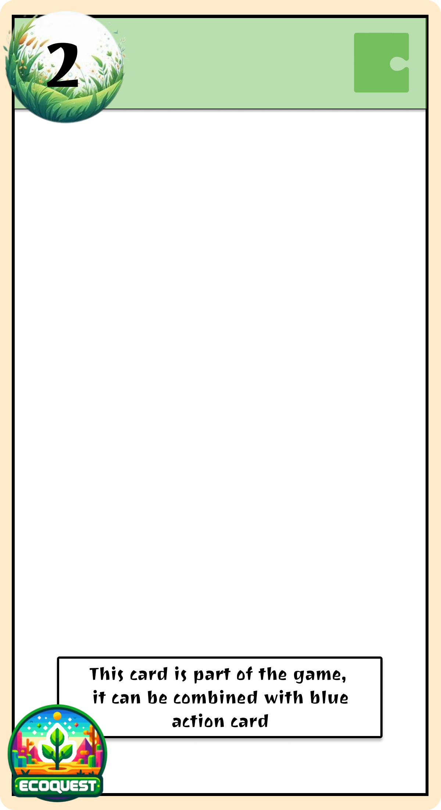

# Functional Specifications

Table of Contents

- [Functional Specifications](#functional-specifications)
  - [1. Introduction](#1-introduction)
    - [1.1. Glossary](#11-glossary)
    - [1.2. Project Overview](#12-project-overview)
    - [1.3. Project Definition](#13-project-definition)
      - [1.3.1. Vision](#131-vision)
      - [1.3.2. Objectives](#132-objectives)
      - [1.3.3. Scope](#133-scope)
      - [1.3.4. Target Audience](#134-target-audience)
      - [1.3.5. Deliverables](#135-deliverables)
    - [1.4. Project Organization](#14-project-organization)
      - [1.4.1. Project Representatives](#141-project-representatives)
      - [1.4.2. Stakeholders](#142-stakeholders)
  - [2. Functional Requirements](#2-functional-requirements)
    - [2.1. Game Components](#21-game-components)
      - [2.1.1. Physical - Card Deck](#211-physical---card-deck)
      - [2.1.2. Digital - Mobile Application](#212-digital---mobile-application)
    - [2.2. Game Mechanics](#22-game-mechanics)
    - [2.3. User Interface (UI)](#23-user-interface-ui)
      - [2.3.1. Physical Cards](#231-physical-cards)
      - [2.3.2. Application](#232-application)
      - [2.3.3. Mockups](#233-mockups)
    - [2.4. Technical Requirements](#24-technical-requirements)
      - [2.4.1. Application](#241-application)
      - [2.4.2. Physical Cards](#242-physical-cards)
    - [2.5. Scenarios](#25-scenarios)
      - [2.5.1. Tutorial](#251-tutorial)
      - [2.5.2. Scenario 1: XXXXX](#252-scenario-1-xxxxx)
    - [2.6. Performance metrics](#26-performance-metrics)
  - [3. Non-Functional Requirements](#3-non-functional-requirements)

## 1. Introduction

### 1.1. Glossary

| Term         | Definition                                                                                       |
| ------------ | ------------------------------------------------------------------------------------------------ |
| Serious Game | A game designed for purposes beyond pure entertainment, often educational or training-focused.   |
| Gamification | The application of game-design elements in non-game contexts to enhance engagement and learning. |
| Godot 4.0    | A cross-platform, open-source game engine used for developing both 2D and 3D games.              |

### 1.2. Project Overview

This project aims to create a serious game focused on climate change, designed to be platform-agnostic, and accessible across diverse devices.

### 1.3. Project Definition

#### 1.3.1. Vision

The vision is to educate players about climate change by embedding factual knowledge in a gamified, adventure-driven environment. The game aims to challenge misconceptions and deepen players’ understanding of environmental issues while keeping the experience enjoyable and interactive.

#### 1.3.2. Objectives

- Develop a Serious Game centered around climate change.
- Design engaging, adventure-based gameplay to captivate players.
- Use Godot 4.0 for seamless deployment across digital platforms.

#### 1.3.3. Scope

This project seeks to:

- Teach users lesser-known facts about climate change.
- Address and correct common misconceptions about the environment.
- Create an accessible and interactive learning tool adaptable for different audiences.

#### 1.3.4. Target Audience

- **Teenagers & Young Adults:** Teenagers willing to expand their general knowledge or to delve deeper into cliamte change understanding.
- **Families:** Families wanting to spend a great time in an adventure together while gaining general knowledge and doing some brain exercises.

#### 1.3.5. Deliverables

The following deliverables will be provided as part of the project:

- Game Assets:
  - Source code for the digital game developed using Godot 4.0.
  - Physical components (e.g., printed cards) used for gameplay.
- Mock-ups and Prototypes:
  - Iterative mock-ups and game prototypes to gather feedback and ensure alignment with client expectations.
- Supporting Documentation:
  - Functional Specification: Outlines the game’s features and functionality.
  - Technical Specification: Details the technical architecture and implementation.
  - Test Plan: Describes the strategy for ensuring the game’s quality and reliability.
  - User Manual: Guides end-users on how to play and interact with the game.
  - Management Planning and Weekly Reports: Tracks progress and highlights milestones.
- Final Presentation:
  - A 15-minute presentation summarizing the project’s outcomes, key insights, and deliverables.

### 1.4. Project Organization

#### 1.4.1. Project Representatives

| Full Name          | Occupation        | Links                                                                      |
| ------------------ | ----------------- | -------------------------------------------------------------------------- |
| Maxime THIZEAU     | Project manager   | [LinkedIn](https://linkedin.com/in/maxime-thizeau-0b311a293)               |
| Benoît DE KEYN     | Program manager   | [LinkedIn](https://www.linkedin.com/in/beno%C3%AEt-de-keyn-71611b293/)     |
| Pavlo PRENDI       | Tech lead         | [LinkedIn](https://www.linkedin.com/in/pavlo-prendi-674777309/)            |
| Aurélien FERNANDEZ | Software Engineer | [LinkedIn](https://www.linkedin.com/in/aur%C3%A9lien-fernandez-4971201b8/) |
| Thibaud MARLIER    | Software Engineer | [LinkedIn](https://www.linkedin.com/in/thibaudmarlier/)                    |
| Mathis KAKAL       | Quality assurance | [LinkedIn](https://www.linkedin.com/in/mathis-k-a239ba10a/)                |
| Antoine PREVOST    | Technical writer  | [LinkedIn](https://www.linkedin.com/in/antoine-prevost-dev/)               |

#### 1.4.2. Stakeholders

| Role   | Representative           | Expectation                                                             |
| ------ | ------------------------ | ----------------------------------------------------------------------- |
| Client | Franck JEANNIN (ALGOSUP) | Project meeting the requirements and traceability of the project events |

## 2. Functional Requirements

### 2.1. Game Components

Our game is hybrid, which means you need both a physical card deck as well as a mobile application to play the game. This prevents young audiences to speend too much time in front of screens, which is a problem nowadays.

#### 2.1.1. Physical - Card Deck

The card deck is the main medium allowing players to progress through the escape game adventures. Each of the card has a unique number or letter, indicated at the back of the card as well as at the top left corner of the card. There are in total 4 types of cards in the game, each distiguishable by the color on the top of the card:

| Card Type Name | Description                                                                                                                                                                                                                                                      | Template image                                  |
| -------------- | ---------------------------------------------------------------------------------------------------------------------------------------------------------------------------------------------------------------------------------------------------------------- | ----------------------------------------------- |
| Information    | Gives information on an element of the gameplay/Gives a fact about climate change                                                                                                                                                                                |           |
| Puzzle         | Contains a puzzle, or one of its parts. The number of the card can be entered when clicking on the "Machine" button and filling the popup to access an interactive version of the puzzle.                                                                        |              |
| Left Action    | They contain a visual element, generally an object, which can be logically combined with an element on a "Right Action Card". The sum of the two cards should allow the player to take the card with the equivalent number, either a penalty or the correct one. |    |
| Right Action   | They contain a visual element, generally an object, which can be logically combined with an element on a "Left Action Card". The sum of the two cards should allow the player to take the card with the equivalent number, either a penalty or the correct one.  |  |

#### 2.1.2. Digital - Mobile Application

### 2.2. Game Mechanics

### 2.3. User Interface (UI)

#### 2.3.1. Physical Cards

#### 2.3.2. Application

#### 2.3.3. Mockups

### 2.4. Technical Requirements 

### 2.4.1. Application (Godot Engine)

#### 2.4.1.1. Orientation and Platform
- The game will run in **portrait mode** only.
- Supported platforms:
  - **Android**: Minimum version 5.0 (Lollipop).
  - **iOS**: Minimum version 14.

#### 2.4.1.2. User Interaction
- **Primary Input**: 
  - The app will exclusively use touch controls for input.
  - Numeric and alphanumeric codes will be entered via a virtual keyboard provided by the app.
- **Phone Sensors**:
  - Certain puzzles will require the use of the device's **gyroscope and accelerometer** for interactions such as:
    1. **Shaking the phone** to simulate actions like clearing objects or mixing contents.
    2. **Reversing the phone** (rotating 180°) to uncover hidden information or solve specific challenges.

#### 2.4.1.3. Timer
- A countdown timer will display the time remaining (starting from 60 minutes for the scenario).
- Time penalties will automatically deduct minutes for incorrect code inputs or app-defined triggers.

#### 2.4.1.4. Background Music
- **Duration**: A minimum of **30 minutes** of thematic background music, looping seamlessly if necessary, to cover the entire session without noticeable interruptions.

#### 2.4.1.5. Machines and Puzzles
- Machines and interactive puzzles will include:
  1. **Input Challenges**: Numeric or alphanumeric codes to be entered into the app.
  2. **Sensor-Based Tasks**: Interaction through shaking or tilting the phone.
  3. **Logic/Combination Challenges**: Users solve puzzles requiring multi-step reasoning (presented visually in the app and referenced on the cards).

---

### 2.4.2. Physical Cards

#### 2.4.2.1. Specifications
- **Quantity**: The game will include **40 cards**.
- **Dimensions**: Cards will measure **11 cm x 6 cm**.
- **Material**: Rigid paper with a **320gsm semi-glossy finish** for durability and ease of handling.
- **Printing**:
  - Full-color double-sided printing.
  - Front: Puzzle or object-related visuals and textual clues.
  - Back: Hints or story elements linked to the front-side puzzle.

#### 2.4.2.2. Functional Design
- Cards will reference other cards by number, enabling exploration (e.g., "Find card 12").
- Each card will clearly display its corresponding **alphanumeric code** for interaction with the app.
- Puzzle progression will depend on physical card combinations (e.g., overlaying, pairing) or specific app inputs.

---

### 2.4.3. App-Card Integration

#### 2.4.3.1. Code Validation
- Cards will include **unique alphanumeric codes** (4–6 characters) to be entered into the app. These codes trigger:
  - Unlocking new puzzles.
  - Progression in the story.
  - Hint systems or penalties.

#### 2.4.3.2. Hint System
- The app will provide a **contextual hint system**:
  - Hints will correspond to card numbers or puzzle stages.
  - A single tap will display progressively detailed hints.

#### 2.4.3.3. Story Progression
- Players will move through the game linearly, with each code unlocking subsequent cards or app content.
- Certain puzzles will involve both physical card manipulation and digital app interactivity.

---

### 2.4.4. Functional Limits and Gameplay Scope

#### 2.4.4.1. Scenario Length
- The single game session will last approximately **30 minutes**, matching the timer duration.

#### 2.4.4.2. No QR Codes
- There will be no QR code scanning or linking mechanisms. All interactions between the cards and the app will be manual (e.g., code entry or physical references).

#### 2.4.4.3. Single Game Design
- The app and card system will only support **one scenario/game**, with no expansions planned.

### 2.5. Scenarios

#### 2.5.1. Tutorial

#### 2.5.2. Scenario 1: XXXXX

### 2.6. Performance metrics

## 3. Non-Functional Requirements

| Type of Non-functional Requirements | Example                                                                              |
| ----------------------------------- | ------------------------------------------------------------------------------------ |
| Performance                         | All application pages should load within 1 second                                    |
| Compatibility                       | The mobile application should be compatible with iOS 12+ and Android Nougat or later |
| Executable Size                     | The size of the executable should not exceed 50MB                                    |
| Accessibility                       | Multilingual Support                                                                 |
| Scalability                         | Support for future scenario packs                                                    |
| Environmental impact                | Printed materials made from sustainable resources                                    |
