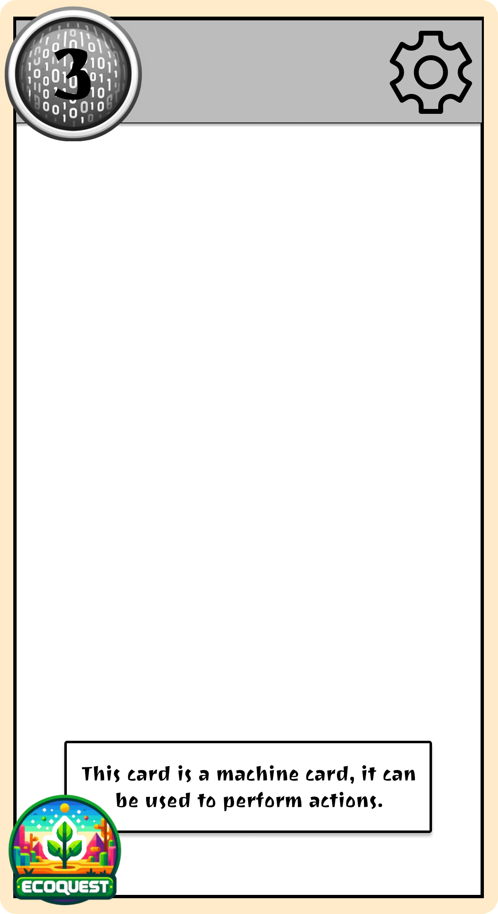
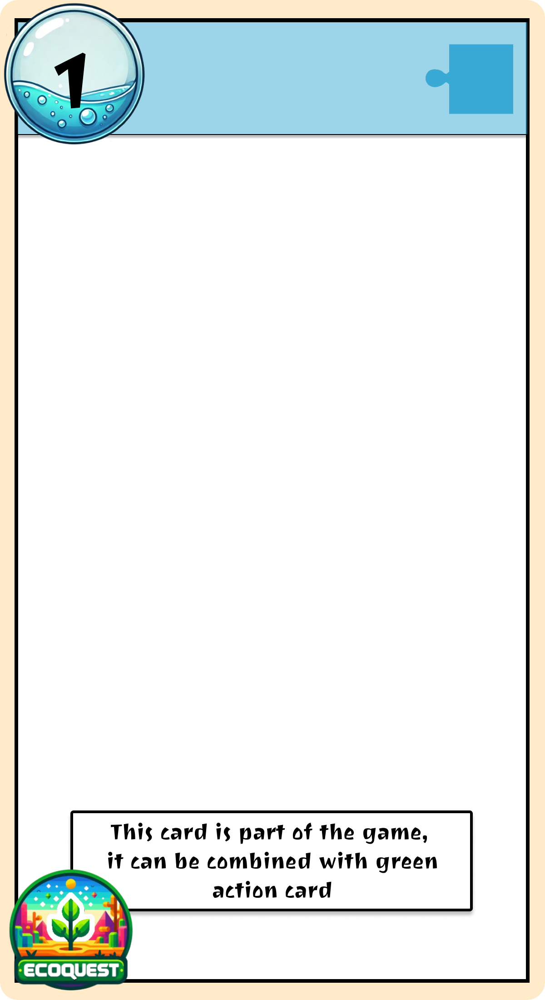

# Functional Specifications

Table of Contents

- [Functional Specifications](#functional-specifications)
  - [1. Introduction](#1-introduction)
    - [1.1. Glossary](#11-glossary)
    - [1.2. Project Overview](#12-project-overview)
    - [1.3. Project Definition](#13-project-definition)
      - [1.3.1. Vision](#131-vision)
      - [1.3.2. Objectives](#132-objectives)
      - [1.3.3. Scope](#133-scope)
      - [1.3.4. Out-of-Scope](#134-out-of-scope)
      - [Reasoning for Exclusions](#reasoning-for-exclusions)
      - [1.3.4. Target Audience](#134-target-audience)
      - [1.3.5. Deliverables](#135-deliverables)
    - [1.4. Project Organization](#14-project-organization)
      - [1.4.1. Project Representatives](#141-project-representatives)
      - [1.4.2. Stakeholders](#142-stakeholders)
  - [2. Functional Requirements](#2-functional-requirements)
    - [2.1. Game Components](#21-game-components)
      - [2.1.1. Physical - Card Deck](#211-physical---card-deck)
      - [2.1.2. Digital - Mobile Application](#212-digital---mobile-application)
  - [2.2. Game Mechanics](#22-game-mechanics)
    - [2.2.1. Overview](#221-overview)
    - [2.2.2. Card Types and Functions](#222-card-types-and-functions)
      - [2.2.2.1 Left/Right Action Cards (Blue/Green Cards)](#2221-leftright-action-cards-bluegreen-cards)
      - [2.2.2.2 Grey Cards (Machines)](#2222-grey-cards-machines)
      - [2.2.2.3 Brown Cards (Locations)](#2223-brown-cards-locations)
      - [2.2.2.4 Red Cards (Penalties)](#2224-red-cards-penalties)
    - [2.2.3. Game Progression](#223-game-progression)
      - [2.2.3.1 Combining Cards](#2231-combining-cards)
      - [2.2.3.2 Interacting with Machines](#2232-interacting-with-machines)
      - [2.2.3.3 Exploring Locations](#2233-exploring-locations)
      - [2.2.3.4 Requesting Hints](#2234-requesting-hints)
      - [2.2.3.5 Time and Penalties](#2235-time-and-penalties)
    - [2.2.4. App Features](#224-app-features)
      - [2.2.4.1 Code Entry](#2241-code-entry)
      - [2.2.4.2 Machine Interactions](#2242-machine-interactions)
      - [2.2.4.3 Audio and Visual Cues](#2243-audio-and-visual-cues)
      - [2.2.4.4 Hint System](#2244-hint-system)
      - [2.2.4.5 Timer](#2245-timer)
    - [2.2.5. Victory and Loss Conditions](#225-victory-and-loss-conditions)
    - [2.3. Mockups](#23-mockups)
      - [2.3.1 Cards Mockups](#231-cards-mockups)
      - [2.3.2 App Mockups](#232-app-mockups)
    - [2.4. Technical Requirements](#24-technical-requirements)
    - [2.4.1. Application (Godot Engine)](#241-application-godot-engine)
      - [2.4.1.1. Orientation and Platform](#2411-orientation-and-platform)
      - [2.4.1.2. User Interaction](#2412-user-interaction)
      - [2.4.1.3. Timer](#2413-timer)
      - [2.4.1.4. Background Music](#2414-background-music)
      - [2.4.1.5. Machine Puzzles](#2415-machine-puzzles)
    - [2.4.2. Physical Cards](#242-physical-cards)
      - [2.4.2.1. Specifications](#2421-specifications)
      - [2.4.2.2. Functional Design](#2422-functional-design)
    - [2.4.3. App-Card Integration](#243-app-card-integration)
      - [2.4.3.1. Code Validation](#2431-code-validation)
      - [2.4.3.2. Hint System](#2432-hint-system)
      - [2.4.3.3. Story Progression](#2433-story-progression)
    - [2.5. Scenarios](#25-scenarios)
      - [2.5.1. Overview](#251-overview)
      - [2.5.2. Tutorial](#252-tutorial)
      - [2.5.2. Transition](#252-transition)
      - [2.5.3. Main Gameplay: Gatekeeper](#253-main-gameplay-gatekeeper)
    - [2.5.3.1 Level 1: Do More with Less](#2531-level-1-do-more-with-less)
      - [Overview](#overview)
      - [Ambience](#ambience)
      - [Difficulty](#difficulty)
      - [Enigma](#enigma)
      - [Resolution](#resolution)
    - [2.5.3.2 Level 2: Biology Lab](#2532-level-2-biology-lab)
      - [Overview](#overview-1)
      - [Ambience](#ambience-1)
      - [Difficulty](#difficulty-1)
      - [Enigma](#enigma-1)
      - [Resolution](#resolution-1)
    - [2.5.3.3 Level 3: Energy Lab](#2533-level-3-energy-lab)
      - [Overview](#overview-2)
      - [Ambience](#ambience-2)
      - [Difficulty](#difficulty-2)
      - [Enigma](#enigma-2)
      - [Resolution](#resolution-2)
    - [2.6. Performance Metrics](#26-performance-metrics)
    - [2.7. End-Game Ranking](#27-end-game-ranking)
      - [2.7.1. Ranking Breakdown:](#271-ranking-breakdown)
  - [3. Non-Functional Requirements](#3-non-functional-requirements)

## 1. Introduction

### 1.1. Glossary

| Term         | Definition                                                                                       |
| ------------ | ------------------------------------------------------------------------------------------------ |
| Serious Game | A game designed for purposes beyond pure entertainment, often educational or training-focused.   |
| Gamification | The application of game-design elements in non-game contexts to enhance engagement and learning. |
| Godot 4.0    | A cross-platform, open-source game engine used for developing both 2D and 3D games.              |

### 1.2. Project Overview

This project aims to create a serious game focused on climate change, designed to be platform-agnostic, and accessible across diverse devices.

### 1.3. Project Definition

#### 1.3.1. Vision

The vision is to educate players about climate change by embedding factual knowledge in a gamified, adventure-driven environment. The game aims to challenge misconceptions and deepen players’ understanding of environmental issues while keeping the experience enjoyable and interactive.

#### 1.3.2. Objectives

- Develop a Serious Game centered around climate change.
- Design engaging, adventure-based gameplay to captivate players.
- Use Godot 4.0 for seamless deployment across digital platforms.

#### 1.3.3. Scope

This project seeks to:

- Teach users lesser-known facts about climate change.
- Address and correct common misconceptions about the environment.
- Create an accessible and interactive learning tool adaptable for different audiences.

#### 1.3.4. Out-of-Scope

1. **Dedicated Game Board or Physical Maps**  
   The project avoids integrating physical boards or printed maps as central gameplay elements. Players will not need to arrange cards on a board or manipulate a paper-based map to solve enigmas. Exploration is purely app-guided, ensuring portability and minimal required materials.

2. **Additional Scenarios or Modular Content**  
   The initial release focuses on a single scenario, *EcoQuest*. While the framework is adaptable for future content, no additional scenarios, expansions, or modular gameplay packs are planned as part of this initial scope.

3. **Multiplayer or Asynchronous Gameplay**  
   The game emphasizes cooperative play within a single session. No features support online multiplayer, turn-based gameplay, or sharing progress across different devices.

4. **Complex App-Card Interactions (e.g., Dynamic Card Placement)**  
   The project excludes puzzles requiring players to physically arrange cards on a predefined template (e.g., aligning cards to create shapes or activate in-app responses). All card interactions involve referencing their numbers and following simple app prompts.
  
5. **Camera-Based Enigma Solving**  
   The app will not use the device’s camera for scanning patterns, solving visual puzzles, or interpreting real-world objects. All interactions and puzzles remain screen-based or card-based.

6. **NFC-Enabled Cards or Devices**  
   While NFC technology can create seamless interactions between physical cards and digital devices, this game does not incorporate NFC-enabled features. All card-to-app interactions rely on manually entering alphanumeric codes for accessibility and simplicity.

#### Reasoning for Exclusions

- **Simplification**: By focusing on manual and screen-based interactions, the design avoids potential technical issues, ensuring broader device compatibility and a smoother player experience.  
- **Accessibility**: Excluding camera and NFC features reduces hardware requirements, making the game playable on a wider range of devices.  
- **Streamlined Development**: Keeping interactions app-based with printed cards aligns with the goal of rapid iteration and efficient production of a polished initial experience.  

This scope balances ambitious features with achievable exclusions, paving the way for future iterations like introducing **EcoQuest expansions** or incorporating more complex mechanics later on.

#### 1.3.4. Target Audience

- **Teenagers & Young Adults:** Teenagers willing to expand their general knowledge or to delve deeper into climate change understanding.
- **Families:** Families wanting to spend a great time in an adventure together while gaining general knowledge and doing some brain exercises.

#### 1.3.5. Deliverables

The following deliverables will be provided as part of the project:

- Game Assets:
  - Source code for the digital game developed using Godot 4.0.
  - Physical components (e.g., printed cards) used for gameplay.
- Mock-ups and Prototypes:
  - Iterative mock-ups and game prototypes to gather feedback and ensure alignment with client expectations.
- Supporting Documentation:
  - Functional Specification: Outlines the game's features and functionality.
  - Technical Specification: Details the technical architecture and implementation.
  - Test Plan: Describes the strategy for ensuring the game's quality and reliability.
  - User Manual: Guides end-users on how to play and interact with the game.
  - Management Planning and Weekly Reports: Tracks progress and highlights milestones.
- Final Presentation:
  - A 15-minute presentation summarizing the project's outcomes, key insights, and deliverables.

### 1.4. Project Organization

#### 1.4.1. Project Representatives

| Full Name          | Occupation        | Links                                                                      |
| ------------------ | ----------------- | -------------------------------------------------------------------------- |
| Maxime THIZEAU     | Project manager   | [LinkedIn](https://linkedin.com/in/maxime-thizeau-0b311a293)               |
| Benoît DE KEYN     | Program manager   | [LinkedIn](https://www.linkedin.com/in/beno%C3%AEt-de-keyn-71611b293/)     |
| Pavlo PRENDI       | Tech lead         | [LinkedIn](https://www.linkedin.com/in/pavlo-prendi-674777309/)            |
| Aurélien FERNANDEZ | Software Engineer | [LinkedIn](https://www.linkedin.com/in/aur%C3%A9lien-fernandez-4971201b8/) |
| Thibaud MARLIER    | Software Engineer | [LinkedIn](https://www.linkedin.com/in/thibaudmarlier/)                    |
| Mathis KAKAL       | Quality assurance | [LinkedIn](https://www.linkedin.com/in/mathis-k-a239ba10a/)                |
| Antoine PREVOST    | Technical writer  | [LinkedIn](https://www.linkedin.com/in/antoine-prevost-dev/)               |

#### 1.4.2. Stakeholders

| Role   | Representative           | Expectation                                                             |
| ------ | ------------------------ | ----------------------------------------------------------------------- |
| Client | Franck JEANNIN (ALGOSUP) | Project meeting the requirements and traceability of the project events |

## 2. Functional Requirements

### 2.1. Game Components

Our game is hybrid, which means you need both a physical card deck as well as a mobile application to play the game. This prevents young audiences to spend too much time in front of screens, which is a problem nowadays.

#### 2.1.1. Physical - Card Deck

The card deck is the main medium allowing players to progress through the escape game adventures. Each of the cards has a unique number or letter, indicated at the back of the card and at the top left of it too. There are in total 4 types of cards in the game, each distiguishable by the color on the top of the card:

| Card Type Name | Description                                                                                                                                                                                                                                                      | Template image                                  |
| -------------- | ---------------------------------------------------------------------------------------------------------------------------------------------------------------------------------------------------------------------------------------------------------------- | ----------------------------------------------- |
| Information    | Gives information on an element of the gameplay/Gives a fact about climate change                                                                                                                                                                                |           |
| Machine        | Redirects to an interactive puzzle on the app, or one of its parts. The number of the card can be entered when clicking on the "Machine" button and filling the popup to access the interactive machine puzzle on the app.                                       |              |
| Left Action    | They contain a visual element, generally an object, which can be logically combined with an element on a "Right Action Card". The sum of the two cards should allow the player to take the card with the equivalent number, either a penalty or the correct one. |    |
| Right Action   | They contain a visual element, generally an object, which can be logically combined with an element on a "Left Action Card". The sum of the two cards should allow the player to take the card with the equivalent number, either a penalty or the correct one.  |  |
| Penalty        | They indicate a wrong path taken by the player, resulting in a time penalty the player has to confirm in the application.                                                                                                                                           |            |

#### 2.1.2. Digital - Mobile Application

## 2.2. Game Mechanics

### 2.2.1. Overview
The game is a cooperative escape-room experience that uses **physical cards** and a **mobile application** as a guide. Players solve puzzles, explore locations, and progress through the story by interacting with cards and the app.

### 2.2.2. Card Types and Functions
Each card serves a specific purpose and drives the game forward. The following categories describe the types of cards and their mechanics:

#### 2.2.2.1 Left/Right Action Cards (Blue/Green Cards)
- **Blue Cards (Left Action Cards)**:
  - Represent **objects** that players can use or interact with.
  - Examples: A key, a hammer, or a tool.
- **Green Cards (Right Action Cards)**:
  - Represent **interactive elements** such as doors, locked containers, or machines.
  - Examples: A locked chest, a door requiring a key, or a safe.

**Mechanic**:  
- Players combine **blue cards (objects)** with **Green cards (interactive elements)** to progress.
- To attempt a combination:
  - Add the numbers of the two cards (e.g., Blue 12 + Green 25 = 37).
  - Find the resulting card number in the deck. If the combination is correct, the new card will advance the game. If incorrect, you get either a penalty card , either no card.

#### 2.2.2.2 Grey Cards (Machines)
- Represent **machines puzzles** requiring special interaction, using the app.
- Examples:
  - A keypad requiring a code.
  - A digital lock that needs to be "assembled."
  - A device that activates when the phone is shaken or rotated.
  
**Mechanic**:  
- Some cards provide hints/instructions, and players interact with the app to solve the machine.
- Solutions often involve logic, observation, or interaction with the phone's sensors.

#### 2.2.2.3 Brown Cards (Locations)
- Represent **explorable areas** where players can find clues, objects, or interact with puzzles.
- Examples: A room, a hallway, or a hidden compartment.

**Mechanic**:  
- Brown cards display multiple points of interest, each marked with a number or symbol.  
- Players search these areas by locating the corresponding cards in the deck.  
- New cards may reveal additional cards to deal with.

#### 2.2.2.4 Red Cards (Penalties)
- Represent **negative consequences**: A time penalty for incorrect combinations.

**Mechanic**:  
- When a penalty card is picked, players must tap the penalty button on the app, which automatically deducts time from the app’s countdown.

### 2.2.3. Game Progression

#### 2.2.3.1 Combining Cards
- Players use the **addition mechanic** to combine cards:
  - Example: A key (Blue 10) + a locked door (Green 15) = Card 25.
  - If the resulting card exists in the deck, it will describe the outcome (e.g., the door is unlocked, revealing more clues).
  - If no such card exists, the combination is invalid.

#### 2.2.3.2 Interacting with Machines
- **Grey cards** introduce puzzles requiring interaction through the app:
  - Players input numeric or alphanumeric codes into the app.
  - They may also solve puzzles using visual or audio cues, logic, or phone gestures (e.g., shaking or tilting the device).

#### 2.2.3.3 Exploring Locations
- Green cards provide a map or visual representation of a location.
- Points of interest (marked with numbers or symbols) direct players to search for new cards in the deck.

#### 2.2.3.4 Requesting Hints
- Players can request contextual hints about a card through the app by entering the relevant card number.
- Hints provide progressive help, starting vague and becoming more detailed with each request.
- **Penalty**: Each hint request deducts **1 minute** from the timer.

#### 2.2.3.5 Time and Penalties
- The app runs a **30-minute timer**, creating a sense of urgency.
- Incorrect actions or failed combinations may trigger penalties, deducting time from the remaining total.

### 2.2.4. App Features
The app supports the following functionalities to complement the cards:

#### 2.2.4.1 Code Entry
- Players enter numeric or alphanumeric codes as prompted by the cards (e.g., unlocking a safe or solving a riddle).

#### 2.2.4.2 Machine Interactions
- The app presents interactive puzzles or mini-games when players engage with Machine cards (grey).
- Examples:
  - Dragging objects to assemble a device.
  - Matching patterns or solving equations.

#### 2.2.4.3 Audio and Visual Cues
- The app enhances immersion through thematic sounds, animations, and visual feedback.
- 5 Music tracks will be made: 1 for the tutorial, one for each level and one for menus.
- Sound effects will be used at critical moments of the game, such as when the timer is running out or when the player succeeds or fails a puzzle to intensify the game. 

#### 2.2.4.4 Hint System
- Hints are tied to specific card numbers and accessible at any time. Players can request multiple hints for the same card.
- **Penalty**: Each hint deducts **1 minute** from the timer.

#### 2.2.4.5 Timer
- A countdown timer runs throughout the game, starting at 60 minutes.
- Time penalties are automatically applied for incorrect actions.

### 2.2.5. Victory and Loss Conditions
- **Victory**: Players successfully solve all puzzles and escape before the timer expires.
- **Loss**: The timer reaches zero before players complete the game. They can continue even after that until the last enigma is solved.

### 2.3. Mockups

All the mockups are available on Figma for both the app to be develop and the cards to be printed.

#### 2.3.1 Cards Mockups

[This Figma page](https://www.figma.com/design/8HPNc76tbBFUHng9vnqG2n/EcoQuest?node-id=296-412&node-type=canvas&t=CMAiP2Gods2REIfN-0) contains all the cards used in the TUTORIAL gameplay. They have a recto and a verso.   
[This Figma page](https://www.figma.com/design/8HPNc76tbBFUHng9vnqG2n/EcoQuest?node-id=296-411&node-type=canvas&t=CMAiP2Gods2REIfN-0) WILL contain all the cards used in the MAIN gameplay.

#### 2.3.2 App Mockups

[This Figma page](https://www.figma.com/design/8HPNc76tbBFUHng9vnqG2n/EcoQuest?node-id=0-1&node-type=canvas&t=CMAiP2Gods2REIfN-0) contains the all the app designs used in the whole game.

### 2.4. Technical Requirements 

### 2.4.1. Application (Godot Engine)

#### 2.4.1.1. Orientation and Platform
- The game will run in **portrait mode** only.
- Supported platforms:
  - **Android**: Minimum version 5.0 (Lollipop).
  - **iOS**: Minimum version 14.

#### 2.4.1.2. User Interaction
- **Primary Input**: 
  - The app will exclusively use touch controls for input.
  - Numeric and alphanumeric codes will be entered via a virtual keyboard provided by the app.
- **Phone Sensors**:
  - Certain puzzles will require the use of the device's **gyroscope and accelerometer** for interactions such as:
    1. **Shaking the phone** to simulate actions like clearing objects or mixing contents.
    2. **Reversing the phone** (rotating 180°) to uncover hidden information or solve specific challenges.

#### 2.4.1.3. Timer
- A countdown timer will display the time remaining (starting from 30 minutes for the scenario).
- Time penalties will automatically deduct minutes for incorrect code inputs or app-defined triggers.

#### 2.4.1.4. Background Music
- **Duration**: A minimum of **30 minutes** of thematic background music, looping seamlessly if necessary, to cover the entire session without noticeable interruptions.

#### 2.4.1.5. Machine Puzzles
- Machines are interactive puzzles on the app which include:
  1. **Input Challenges**: Numeric or alphanumeric codes to be entered into the app.
  2. **Sensor-Based Tasks**: Interaction through shaking or tilting the phone.
  3. **Logic/Combination Challenges**: Users solve puzzles requiring multi-step reasoning (presented visually in the app and referenced on the cards).

### 2.4.2. Physical Cards

#### 2.4.2.1. Specifications
- **Quantity**: The game will include **40 cards**.
- **Dimensions**: Cards will measure **11 cm x 6 cm**.
- **Material**: Rigid paper with a **320gsm semi-glossy finish** for durability and ease of handling.
- **Printing**:
  - Full-color double-sided printing.
  - Front: Puzzle or object-related visuals and textual clues.
  - Back: Hints or story elements linked to the front-side puzzle.
  - Back and front will include the card's **unique alphanumeric code**.

#### 2.4.2.2. Functional Design
- Cards will reference other cards by number, enabling exploration (e.g., "Find card 12").
- Each card will clearly display its corresponding **alphanumeric code** for interaction with the app.
- Puzzle progression will depend on physical card combinations (e.g., overlaying, pairing) or specific app inputs.

### 2.4.3. App-Card Integration

#### 2.4.3.1. Code Validation
- Cards will include **unique alphanumeric codes** (4-6 characters) to be entered into the app. These codes trigger:
  - Unlocking new puzzles.
  - Progression in the story.
  - Hint systems or penalties.

#### 2.4.3.2. Hint System
- The app will provide a **contextual hint system**:
  - Hints will correspond to card numbers or puzzle stages.
  - A single tap will display progressively detailed hints.

#### 2.4.3.3. Story Progression
- Players will move through the game linearly, with each code unlocking subsequent cards or app content.
- Certain puzzles will involve both physical card manipulation and digital app interactivity.

### 2.5. Scenarios

#### 2.5.1. Overview

The application, and our company is named **EcoQuest**.

The game, which is our first adventure, is called **Gatekeeper**, and the story begins like this:

The story has 2 parts : The Tutorial gameplay and the Main gameplay.

All the design thinking of the scenario and cards are available on [this spreadsheet](https://docs.google.com/spreadsheets/d/16rkbt74pS5Rb-UToZqiECkykuM-bd2_UqGowPhPE3_A/edit?gid=0#gid=0)

Details for each gameplay are given below.

#### 2.5.2. Tutorial

Before the 30 minutes main gameplay, a 10 minutes long tutorial introduces to the player:
- The scenario of the game
- The global game mechanics
- The kind of cards and their interactions  

The tutorial works as a mini gameplay where the player's mistakes are not took into account for the main one. It will help the player to understand the game rules and mechanics.  
The player can only progress to the main game once the tutorial is completed.
A transition on the mobile app will smoothly guide the player from the tutorial to the main game, including scenario reaveals.  

Thus the tutorial is playable with the already designed cards on the [figma page](https://www.figma.com/design/8HPNc76tbBFUHng9vnqG2n/EcoQuest?node-id=296-412&node-type=canvas&t=CMAiP2Gods2REIfN-0) given above.

The following graph shows the storyline of the tutorial adventures:
*Each bloc corresponds to a card, the color indicating its type*

#### 2.5.2. Transition

You succeed in decrypting the folder, and a chilling realization dawns upon you. A flood of hidden documents fills your screen, exposing the sinister underbelly of Omega Corp. The company’s polished image of ecological advocacy crumbles under the weight of these revelations: clandestine operations, a shadowy parallel organization pulling the strings, and the horrifying truth behind global environmental disasters. The green facade wasn’t a mission—it was a ruse. Their so-called "ecological efforts" served as nothing more than a smokescreen for motives far darker and greedier than you ever imagined.

But then, one file stops you cold: a list titled “Silenced Employees.” Its contents are partially corrupted, but one name leaps out at you like a dagger to the heart—your closest colleague, the friend who vanished from work without explanation just weeks ago. Now, you understand why.

Fueled by the need for revenge and a burning desire for justice, you resolve to expose Omega Corp for what it truly is. No more hiding behind their lies. No more unchecked power. Steeling yourself, you set your sights on their headquarters. The shadow war begins...

#### 2.5.3. Main Gameplay: Gatekeeper

As you find access to the underground of the Omega Corp building, you discover a hidden places.

The underground is splitted into 3 stages:
The lower you dive, the more you discover the truth about complex activities of Omega Corp, and the longer you take time to finsih the level.

The following descriptions of each level are not already designed in details. The cards and machines still have to be designed in detailled in parallel of the development of the tutorial.

### 2.5.3.1 Level 1: Do More with Less  
**Estimated Time:** 5 minutes  

#### Overview  
The player begins their journey in the cold, industrial basement of Omega Corp’s building. Exploring the area, they uncover clues about Omega Corp’s secretive development of alternative household consumer products. However, they learn that the company intends to withhold these innovations from the market for 10 years to maintain monopolistic control. This discovery sets the stage for the player’s mission to expose Omega Corp’s unethical practices.  

#### Ambience  
- **Theme:** A chemical lab.  
- **Colors:** Neon blue accents; other colors are dim and muted.  
- **Details:**  
  - Metallic walls, glass tables, heavy machinery, and biohazard warning signs.  
  - Moderate lighting, suggesting recent activity in an otherwise dormant lab.  

#### Difficulty  
- Designed to introduce gameplay mechanics and create manageable tension.  
- Guides players while keeping challenges straightforward.  

#### Enigma  
- **Objective:**  
  - Players must locate four chemical formula cards hidden around the lab.  
  - Combining these cards grants access to a mixing machine, which challenges the player with a jug problem: they must measure and mix precise amounts of chemicals to create a formula.  
- **Optional Adjustment:**  
  - Increase difficulty in finding the cards for added exploration.  
  - Simplify the machine interaction for a more satisfying resolution (e.g., enhanced sound effects).  

#### Resolution  
Completing the formula causes the mixing machine to explode, spilling corrosive liquid that burns a hole in the floor. This breach reveals a path to the next area, and the player takes the elevator to Level 2, now equipped with a Level 2 Badge.  

### 2.5.3.2 Level 2: Biology Lab  
**Estimated Time:** 7 minutes  

#### Overview  
The player emerges in a vast, lush biology lab filled with plant life. This level highlights Omega Corp’s concealment of viable solutions to global agricultural problems, such as resilient plant systems and sustainable farming methods. The player learns about the resilience of nature and the harmful effects of chemical overuse on soil, all while working to solve the next challenge.  

#### Ambience  
- **Theme:** A living, experimental environment.  
- **Colors:** Predominantly green, with metallic accents emphasizing the lab’s industrial nature.  
- **Details:**  
  - Test vials, lab equipment, and experimental devices scattered throughout.  
  - Lower lighting than Level 1, creating a mysterious and organic atmosphere.  

#### Difficulty  
- Builds on Level 1 by introducing more exploration and problem-solving.  
- Players must search for clues and complete light puzzles to progress.  

#### Enigma  
- **Objective:**  
  - Players must gather and plant various seeds on a 3x3 grid, following permaculture principles to ensure symbiotic growth.  
  - Seeds are scattered across two rooms, with some given freely and others hidden or locked behind simple puzzles (e.g., card combinations or hidden numbers).  
- **Mechanics:**  
  - Players must determine the correct planting positions by considering factors such as compatibility and growth patterns.  
  - Feedback (e.g., glowing plants or sound effects) indicates success.  

#### Resolution  
Successfully completing the “Garden” puzzle activates the elevator, allowing the player to proceed to Level 3.  

### 2.5.3.3 Level 3: Energy Lab  
**Estimated Time:** 8–10 minutes  

#### Overview  
In this high-tech energy lab, the player uncovers Omega Corp’s deliberate efforts to spread inefficient technologies while suppressing advancements in renewable energy and storage. The level challenges the player to rethink misconceptions about energy losses and the importance of efficient distribution, storage, and consumption.  

#### Ambience  
- **Theme:** A futuristic energy research facility.  
- **Colors:** Bright neon yellow and white accents, symbolizing energy and power.  
- **Details:**  
  - Glowing energy cells, holographic displays, wires, and sparking panels.  
  - A subtle hum of machinery, with occasional sparks and flickers of light.  

#### Difficulty  
- Introduces interconnected puzzles requiring logical thinking and resource management.  
- Builds on concepts from earlier levels, challenging players with a more complex enigma.  

#### Enigma  
- **Objective:**  
  - Players must balance energy distribution across several storage units while minimizing losses.  
  - Using energy modules (e.g., 10 kWh, 20 kWh), players allocate energy to storage cells with varying capacities and efficiencies.  
- **Mechanics:**  
  - Each storage unit has a loss rate and a maximum capacity (e.g., “10% energy lost per 10 kWh stored”).  
  - Players must optimize their allocations using real-time feedback from a holographic power grid.  
  - Misleading options highlight common misconceptions, such as overcharging efficient units (causing overflow) or relying on inefficient systems (leading to massive losses).  

#### Resolution  
Completing the puzzle causes an energy system overload, resulting in a blackout. Emergency power activates, revealing a hidden pathway. The player proceeds to the next level, armed with new knowledge about energy efficiency and a deeper suspicion of Omega Corp.  

### 2.6. Performance Metrics

At the end of each game, the application will display the statistics of the adventure. Below is the exhaustive list of metrics and their calculation methods:

| Statistic Name                 | Calculation Method                                                               |
| ------------------------------ | -------------------------------------------------------------------------------- |
| Time Spent                     | Total time elapsed from the start of the game, including any penalties incurred. |
| Penalties                      | The number of times the *Penalty* button was pressed.                            |
| Number of Hints Viewed         | Total number of unique hints requested by the player.                            |
| Incorrect Machine Code Entries | The number of incorrect machine codes entered by the player (if applicable).     |
| Incorrect Code Submissions     | Total number of incorrect code entries made by the user in the application.      |

### 2.7. End-Game Ranking  

Players will receive a star ranking (1–5) based on their performance. Stars are deducted based on the following criteria:  

| Criteria                                 | Condition for Losing a Star                                                 |
| ---------------------------------------- | --------------------------------------------------------------------------- |
| Time Limit Exceeded                      | If the player exceeds the allotted time for the game.                       |
| Wrong Machine Code Entries (Threshold 1) | Submitting more than 2 incorrect machine codes results in losing 1 star.    |
| Wrong Machine Code Entries (Threshold 2) | Submitting 3 or more additional incorrect machine codes loses another star. |
| Hints Viewed                             | If the player views more than 10% of the total available hints.             |
| Excessive Penalties                      | If the player incurs more than 5 penalties.                                 |

#### 2.7.1. Ranking Breakdown:
- **5 Stars**: Perfect performance (no stars lost).  
- **4 Stars**: Minor mistakes (lose 1 star).  
- **3 Stars**: Moderate mistakes (lose 2 stars).  
- **2 Stars**: Significant mistakes (lose 3 stars).  
- **1 Star**: Major issues (lose 4 stars).  
- **0 Stars**: Game completed but fails to meet any performance standards (lose all stars).  

## 3. Non-Functional Requirements

| Type of Non-functional Requirements | Example                                           |
| ----------------------------------- | ------------------------------------------------- |
| Performance                         | All application pages should load within 1 second |
| Executable Size                     | The size of the executable should not exceed 50MB |
| Accessibility                       | Support for French and English                              |
| Extensibility                         | Support for future scenario packs                 |
| Environmental impact                | Printed materials made from sustainable resources |

