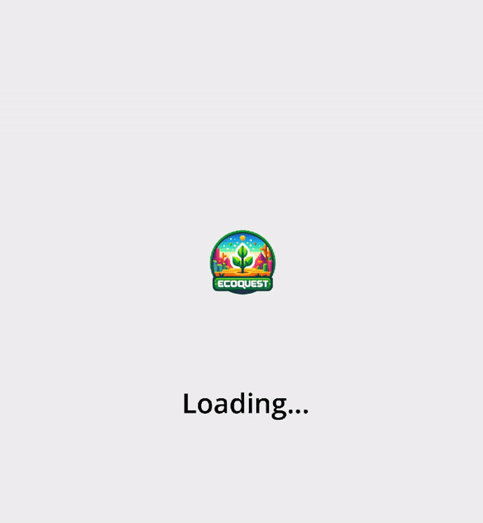

<details>
<summary>
Table of content
</summary>

 - [1. Introduction](#1-introduction)
     - [Document Purpose & Definition](#document-purpose--definition)
     - [Project Overview](#project-overview)
         - [Project Brief](#project-brief)
         - [Requirements](#requirements)
         - [setting up the development environment](#setting-up-the-development-environment)
             - [Hardware Requirements](#hardware-requirements)
             - [Software Requirements](#software-requirements)
             - [Coding Methodology](#coding-methodology)
                 - [Workflow](#workflow)
                 - [Coding Conventions](#coding-conventions)
                 - [Commenting Conventions](#commenting-conventions)
                 - [Documenting Conventions](#documenting-conventions)
    - [Setting up the game](#setting-up-the-game)
         - [Hardware Requirements](#hardware-requirements-1)
         - [Software Requirements](#software-requirements-1)
 - [Technical Specifications](#2-technical-specifications)
     - [Folder Structure](#folder-structure)
     - [Data Structures](#data-structures)
         - [Splash Screen](#splash-screen)
         - [Home Page](#home-page)
         - [Settings Page](#settings-page)
         - [Chapter Select](#chapter-select)
         - [Game Page](#game-page)
         - [Code Page](#code-page)
         - [Code Win Page](#code-win-page)
         - [Code Error Page](#code-error-page)
     - [Glossary](#glossary)

</details>


# 1. Introduction

# Document Purpose & Definition

The goal of the Technical Specifications is to take the Functional Requirements which defines the features, scope and goals of the project, to dissect each requirement and turn it into instructions, as clear as possible, to guide the development team as well as the quality assurance team in the successful completion of their mission.

We therefore encourage thorough reading of the [Functional Specifications](https://github.com/algosup/2024-2025-project-2-serious-game-team-8/blob/main/documents/functional_specifications/functional_specifications.md) before reading further.

The goal of the Technical Requirements is to clarify as many dark areas as possible to avoid the engineers making decisions.
In a sense, while the Functional Requirements represent the "What/Why" aspect of the project, the Technical Requirements are supposed to represent the "How" of the project.

With that being said, we will try to cover as many functional and non-functional aspects of the project while making technological and architectural decisions, evaluating those decisions, measuring their associated risks and impact (providing mitigation) and compare those to other potential solutions.

The document should also benefit other stakeholders and project owners by giving insight into our methodology and may serve as a future reference for maintenance or simple documentation purposes.

## Scope

The scope of the project is to prioritize educating users on climate change through engaging, interactive elements, with the gameplay serving as a supportive framework to reinforce the educational objectives.

## Target audience 

The document is primarily intended for stakeholders, providing a clear understanding of the project's objectives and scope. Additionally, it serves as a valuable reference for developers and QA teams, offering insights into the design and implementation aspects.

# Project Overview 

## Project Brief

As stated in the functional requirements, the goal of the project is to create a serious game focused on climate change, combining a board game with cards and a mobile app, which are both required to play, creating a integrated and interactive experience. The mobile app will be designed using Godot.

We have been given 7 weeks to finish the project.
We chose to develop a board and mobile game because it allows us to concentrate on exploring and researching climate change and integrating these elements into a serious game. This approach aligns with our focus, without the added complexity of developing a PC game.

## Requirements 

While this document aims to be as clear and concise as possible to ensure a full understanding of the mobile game's implementation, some basic coding knowledge is necessary to fully grasp the code-related sections. The engine utilized will be Godot 4.0 and the code will be GDScript.

The game will be able to be run on IOS/Android and you will require the board game in order to play.

## Setting up the development environment 

The first step is to set up the development environment, which we can define as follows:

### Hardware Requirements

- A mobile phone 
- A pc 
- A physical board and cards for the game
- Additional papers which would include the tutorial/manual 

### Software Requirements

- Any OS that supports Godot
- Any text editor 
- GitHub or any other source control management, [GitHub](https://github.com/) is recommended for this task.

## User requirements

The user should expect a basic explanation of the game in the form of a tutorial 
which will be provided in a pamphlet along with the cards.


### Coding Methodology

#### <ins>Workflow</ins>

As this game combines a mobile app with a card game, the focus is split between the app’s development and the implementation of the cards. For details about the cards and their functionality, refer to the [Functional Specifications](https://github.com/algosup/2024-2025-project-2-serious-game-team-8/blob/main/documents/functional_specifications/functional_specifications.md). This section will focus primarily on the app’s implementation.

#### <ins>Coding Conventions</ins>

1. **Variables and constants**
	- Use snake_case for variables and UPPERCASE_WITH_UNDERSCORES for constants.
	- Choose descriptive names that clearly indicate their purpose.

2. **Function Names**
	- Use snake_case for function names.
	- Begin with a verb to clearly describe the function’s action or purpose.

3. **Class Names**
	- Use PascalCase for class names to distinguish them from variables and functions.
	- Class names should be nouns or noun phrases that describe the purpose of the class.

4. **Signals** 
	- Use snake_case for signals, with names that describe the event being triggered.
    - Prefix connected functions with _on_ to clarify they are signal handlers.

5. **Scene and Node Names**
	- Use lowerCamelCase for scenes and node names to distinguish them from variables and scripts.
    - Use descriptive names that indicate the role of the scene or node.

#### <ins>Commenting Conventions </ins>

Comment near 100% of the Functions in the code

#### <ins>Documenting Conventions</ins>

All project documentation will be written in **Markdown**. This includes technical documentation, code comments, and user manuals. Markdown files will be stored in the `docs/` folder in the repository.


## Setting up the game

### Hardware requirements 

- Mobile device, either Android version 5.0 and higher, or iOS version 14 and higher.
- Cards (see F.S.(TODO) For more detail)

### Software requirements 

- Godot Version 4.0
- Figma

# 2. Technical Specifications 

The technical Specifications will attempt to go through the development process of the game.

## Folder Structure 

The folder structure of the serious game project will be defined as follows, according to the requirements of GDScript and the multiple facets of game development.

```
📦 res://
├─📁 addons
│  └─📄 gdscript_formatter
├─📁 resources
│  ├─📁 background
│  ├─📁 chapterImages
│  ├─📁 font
│  ├─📁 musics
│  └─📁 svg
├─📁 script
│  ├─📝 chapters_selection.gd
│  ├─📝 code_error_message.gd
│  ├─📝 code_page.gd
│  ├─📝 code_win_page.gd
│  ├─📝 game_page.gd
│  ├─📝 global.gd
│  ├─📝 home_page.gd
│  ├─📝 settings_page.gd
│  └─📝 splash_screen.gd
├─📁 scene
│  ├─🖼️ backgroundSplashScreen.png
│  ├─📝 chapters_selection.tscn
│  ├─📝 chapter_one_win.tscn
│  ├─📝 code_error_message.tscn
│  ├─📝 code_page.tscn
│  ├─📝 code_win_page.tscn
│  ├─📝 game_page.tscn
│  ├─📝 home_page.tscn
│  ├─📝 settings_page.tscn
│  └─📝 splash_screen.tscn
├─📄 default_bus_layout.
└─🖼️ ecoquest_logo.png
```

- The resources folder will be used to store different types of material such as sprites, 
images, music files and so on.

- The script folder will be used to store the code of each scene.

- The scene folder will be used to store each scene of the game.

## Data structures

### GDScript Overview

GDScript is a high-level, dynamically-typed scripting language used in Godot for game logic. Its syntax is simple and Python-like, making it accessible yet powerful for game development.

### Flowchart 

In this flowchart, you can see how the user will be able to navigate through the app.

### Splash Screen

Displays the game's logo and transitions to the main menu after a brief delay.

- Code implementation

```markdown

1. Initialize Splash Screen
   └── Load background
   └── Load logo
   └── Set up loading text (e.g., "Loading...")

2. Set Up UI
   └── Create a fixed UI layer
       └── Add background
       └── Add logo
       └── Add loading text

3. Display Splash Screen
   └── Render all elements:
       └── Show background color or image
       └── Display logo
       └── Show "Loading..." or introductory text

4. Start Loading Process
   └── Begin asset loading:
       └── Animate progress or show spinner
       └── Update visual cues (optional)
   └── Wait until assets are fully loaded

5. Transition to Main Game
   └── Fade out splash screen
   └── Load the main menu or game scene
```

- Result 



### Home page

Acts as the main hub for the app, allowing users to start the game or access the settings menu.

- Code implementation
```markdown
1. Initialize Home Page
   └── Load the root node (`Node2D`).
   └── Set up the main menu layout:
       └── Add texture button.
       └── Add settings button.

2. Handle Button Press Events
   └── Texture Button Pressed
       └── Instantiate the chapter selection scene.
       └── Add it as a child node to the current scene.

   └── Settings Button Pressed
       └── Instantiate the settings scene.
       └── Add it as a child node to the current scene.
```

### Settings Page

Provides options for the user to adjust audio settings and view the app’s GitHub repository. Includes a way to return to the home page.

- Code implementation

```markdown
1. Initialize Settings Page
   └── Load the root node.
   └── Set up UI components, including:
       └── Music slider.
       └── Close button.
       └── GitHub button.

2. Configure Audio Settings
   └── Set the audio bus volume to the saved value.
   └── Initialize the slider's value to the saved global value.

3. Handle Slider Changes
   └── Connect the slider's `value_changed` signal.
   └── On slider value change:
       └── Update the global volume value.
       └── Adjust the audio bus volume in real-time.

4. Handle Close Button
   └── On close button press:
       └── Remove the settings page from the scene.

5. Handle GitHub Button
   └── On GitHub button press:
       └── Open the repository in the default browser.
```

### Chapter Select 

Allows the user to select a chapter to play. Only the first chapter is unlocked initially, with subsequent chapters becoming accessible after progression.

- Code implementation
```markdown
1. Initialize Chapter Select Page
   └── Load the root node (`Node2D`).
   └── Set up UI components, including:
       └── Chapter selection buttons.
       └── Settings button.

2. Handle Button Press Events
   └── Settings Button Pressed
       └── Instantiate the settings scene.
       └── Add it as a child node to the current scene.

   └── Chapter Selection Button Pressed
       └── Switch to the game page scene.
```

### Game page

The primary gameplay screen where players review hints, interact with the environment, manage time, and solve puzzles.

- Code implementation
```markdown
1. Initialize Game Page
   └── Set up the timer and background elements.
   └── Load visibility icons and prepare controls.

2. Manage Timer
   └── Track time left and update the timer display.
   └── If time is low (2 minutes or less), change the timer text color to red.
   └── On timeout:
       └── Display the "lose" screen.

3. Handle Pause Button
   └── Toggle the `is_paused` state.
   └── Pause or resume the timer and animations.

4. Handle Visibility Button
   └── Toggle the visibility of game controls.
   └── Update the visibility icon accordingly.

5. Remove Leaves
   └── As time decreases, make background leaves disappear in stages.

6. Open Additional Pages
   └── **Settings Button**: Instantiate and display the settings page.
   └── **Code Button**: Instantiate and display the code input page.

7. Increment Timer
   └── On increment timer timeout:
       └── Add one second to the timer.
       └── Adjust minutes when seconds reach 60.

8. Check Chapter Progress
   └── If Chapter 1 is completed:
       └── Display the Chapter 1 completion page.
```

### Code page 

Serves as a puzzle-solving screen, for now it will only contain one puzzle.

- Code implementation
	This code manages the timer display synchronization, input handling for numeric values (with increment and decrement functionality), and the validation of a code entry with a win/error page transition.

```markdown
1. Initialize Code Page
   └── Sync the timer text color with the parent scene.

2. Handle Return Button
   └── On return button press:
       └── Remove the code page from the scene.

3. Manage Input Fields
   └── Input Fields:
       └── **Increment**: Increase the number or reset to 0 if it reaches 9.
       └── **Decrement**: Decrease the number or reset to 9 if it reaches 0.

4. Validate Code
   └── On enter button press:
       └── Check if the input matches the correct code ("4732").
       └── If correct:
           └── Display the win page.
           └── Mark Chapter 1 as complete.
       └── If incorrect:
           └── Display the error page.
```

### Code win page

Displays a congratulatory message to the player for successfully solving the puzzle by entering the correct combination.

- Code Implementation
```markdown
1. Initialize Code Win Page
   └── Display the win page content.

2. Handle Close Button
   └── On close button press:
       └── Change the scene to the chapter selection page.

```
### Code error page

Alerts the player when an incorrect code is entered and penalizes them by deducting time from the countdown timer (feature pending implementation).

- Code implementation
```markdown
1. Initialize Code Error page
   └── Display the error page content.

2. Handle Close Button
   └── On close button press:
       └── Remove the error page from the scene.
```

# Glossary

| Name | Description | 
| -- | --|
| **Hybrid Game** | A game combining physical and digital elements. |
| **Godot Engine** | The game engine used for development. |
| **Functional Requirements** | The "what" of the project, defining features and scope. |
| **Technical Specifications** | The "how" of the project, detailing implementation and architecture. |
| **Serious Game** | A game designed for educational purposes, such as climate change awareness. |


